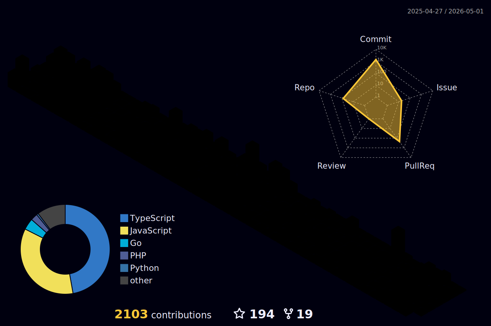

  

###

  
  
  
  
  
  

## Have a look

<!-- 🚀 Animated Title -->
<h1 align="center" style="font-size: 32px; font-weight: bold; color: #fff; background: linear-gradient(90deg, #00ffd5, #ff00c3); padding: 10px; border-radius: 10px; box-shadow: 0 0 20px rgba(0,255,255,0.5);">
  🚀 Tech Stacks
</h1>

<!-- 🌐 Frontend -->
<h2 align="center" style="color:#61dafb">🌐 Frontend Development</h2>

  
  
  
  
  
 
  
  
  

<!-- 🛠️ Backend -->
<h2 align="center" style="color:#facc15">🛠️ Backend Development</h2>

  
  
 
  
  
  
  
  

<!-- ⚙️ DevOps -->
<h2 align="center" style="color:#00c4ff">⚙️ DevOps & Infra Tools</h2>

  
  
    
  
  

<!-- 🎨 Design -->
<h2 align="center" style="color:#ff69b4">🎨 Design Tools</h2>

  
  

<!-- 🔗 Web3 -->
<h2 align="center" style="color:#9d4edd">🔗 Web3 & Blockchain</h2>

  
  
  
  
  
  

<!-- 🧠 AI/ML -->
<h2 align="center" style="color:#4ade80">🧠 AI / Machine Learning</h2>

  
  
  
  

# 📊 GitHub Stats:

 
 

## 🧊 My 3D Contribution Calendar

 

