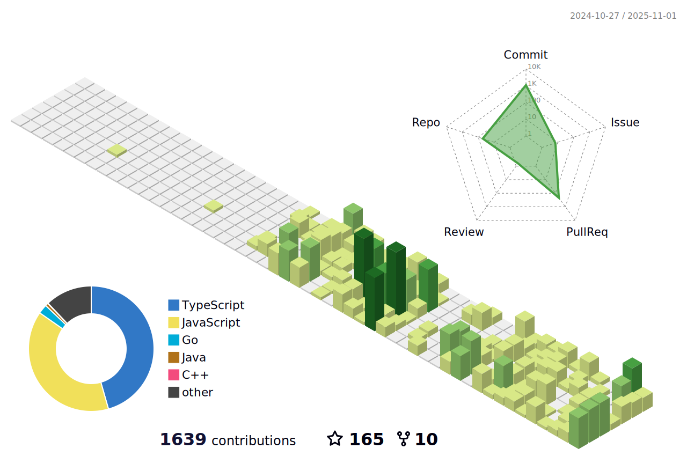

# Hi I am Tanmay

###

  
  
  
  
  
  

###

#                                     A Passionate Open-Source Contributor

# 📊 GitHub Stats:
 
 

---

<!-- Proudly created with GPRM ( https://gprm.itsvg.in ) -->
## Have a look

### Skills 

                    

